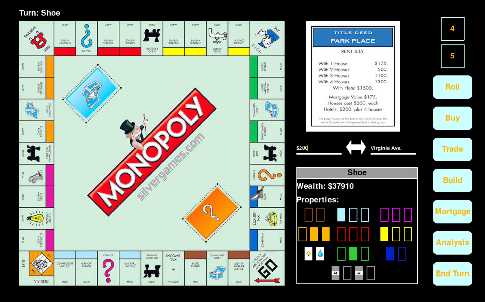

# Monopoly Game

**Author**: Zubair Lalani - [`zubairl2@illinois.edu`](mailto:example@illinois.edu)

### Overview

This project is a multiplayer monopoly replica. The goal of this project is to learn about networking in order to create online games. Most of the monopoly rules will be followed, however some will be left out for the time being. The main goal is to get a clean UI that runs the game smoothly, and to implement the networking capabilities. If time permits, rules such as mortgaging and bidding will be implemented, however they will be left out for now.

### Progress

Thus far, I've implemented all of the UI and good portion of the functionality. The player can now move around the board based on the dice roll, and buy properties. In addition, gui components such text input and drop down menus have been created. Properties appear on the right as a player lands on them.

